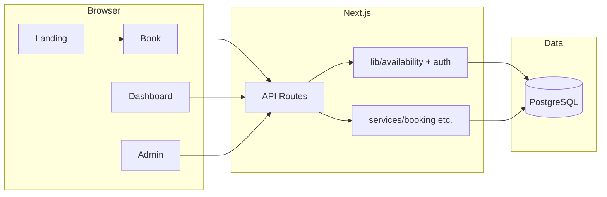

# Bookify — System Breakdown & Progress

This document describes what the repository contains today, how the architecture is organized, the main user and data flows, and sensible next steps for improvement.

---

## 1. What This System Is

**Bookify** is a web application for **service-based appointment booking**: businesses define **services** (price, duration, capacity), define **availability windows** (recurring by weekday or one-off dates), and **customers** register, sign in, pick a slot, and manage bookings. An **admin** role can create/delete services and view or cancel all bookings.

The product name is inconsistent in a few places: the UI and root metadata use **Bookify**, `README.md` titles the project **BookFlow**, and `package.json` names the package **`dev`**. Aligning those reduces confusion for deploys and documentation.

---

## 2. Technology Stack

| Layer | Choice |
|--------|--------|
| Framework | **Next.js 16** (App Router) |
| UI | **React 19**, **Tailwind CSS 4**, **shadcn/ui**-style components (`components/ui/`) |
| Language | **TypeScript** |
| Database | **PostgreSQL** via **Prisma 5** |
| Auth | **JWT** (`jsonwebtoken`) in an **httpOnly** cookie (`bookify_token`), password hashing with **bcryptjs** |
| Validation | **Zod** on API routes and client forms |
| Dates | **date-fns** |

**Scripts** (`package.json`): `dev`, `build`, `start`, `lint`, `prisma:generate`, `prisma:seed` (seed runs `ts-node prisma/seed.ts`).

**Environment**: Prisma expects `DATABASE_URL`. Auth expects `JWT_SECRET` in production (a development fallback exists in code and must not be used in production).

---

## 3. Repository Layout (How Structure Works)

```
bookify/
├── app/                          # Next.js App Router
│   ├── api/                      # Route handlers (REST-style JSON APIs)
│   │   ├── auth/                 # login, register, logout, me
│   │   ├── admin/bookings/       # Admin-only booking list
│   │   ├── availability/         # List + admin CRUD (+ [id])
│   │   ├── bookings/             # List/create + per-id cancel
│   │   ├── services/             # Public list + admin create/update/delete (+ [id])
│   │   └── health/               # Liveness-style check
│   ├── page.tsx                  # Marketing landing
│   ├── book/page.tsx             # Customer booking wizard
│   ├── dashboard/page.tsx        # Customer dashboard (redirects admins)
│   ├── bookings/page.tsx         # Alternate bookings list
│   ├── admin/page.tsx            # Admin dashboard (services + bookings)
│   ├── auth/login|register/      # Auth pages
│   └── layout.tsx                # Root layout, fonts, globals
├── components/
│   ├── landing/                  # Landing page sections
│   ├── shared/                   # e.g. AppHeader
│   └── ui/                       # Reusable primitives (Button, Card, Form, …)
├── lib/
│   ├── prisma.ts                 # Singleton Prisma client (dev global reuse)
│   ├── auth.ts                   # JWT, cookie helpers, requireAuth
│   ├── availability.ts           # Slot math + DB queries for windows/overlap
│   ├── types/index.ts            # Hand-written TS types (not Prisma-derived)
│   └── utils.ts                  # cn() etc.
├── services/
│   ├── booking.service.ts        # Booking domain logic + side-effect hooks
│   ├── payment.service.ts        # Stub / not implemented
│   ├── email.service.ts          # Stub / console-only
│   └── calendar.service.ts       # Stub / not implemented
└── prisma/
    ├── schema.prisma             # Data model
    └── seed.ts                   # Demo users, services, availability
```

**Pattern**: **API routes** own HTTP concerns (status codes, Zod parsing, `requireAuth`). **`lib/availability.ts`** centralizes slot generation and overlap checks used by both **`BookingService`** and **`app/api/bookings/route.ts`**. **`services/`** holds pluggable modules; only **booking** is substantially implemented, and even there the **POST `/api/bookings`** path **reimplements** validation and persistence instead of delegating to `BookingService.createBooking`, so there is **duplication** between the route and the service.

---

## 4. Data Model (Prisma)

- **`User`**: `email` (unique), `passwordHash`, `Role` (`ADMIN` | `CUSTOMER`), optional `name`, related `bookings`.
- **`Service`**: `name`, `description`, `priceCents`, `currency`, `durationMinutes`, `capacity` (default 1).
- **`Availability`**: tied to a `serviceId`; either **`dayOfWeek`** (0–6) **or** a specific **`date`**; `openTime` / `closeTime` as `HH:mm` strings; `durationMinutes` for slot grid within that window.
- **`Booking`**: `userId`, `serviceId`, `startTime`, `endTime`, `BookingStatus` (`PENDING` | `CONFIRMED` | `CANCELLED`).  
  - Indexed by `userId` and `(serviceId, startTime)`.  
  - **`@@unique([serviceId, startTime])`** enforces at most one booking per service at a given start instant (see **capacity** note below).

**`lib/types/index.ts`** defines interfaces (e.g. `User`, `Booking`, `Payment`) that **do not match** Prisma enums and field names (e.g. lowercase roles, extra payment fields). Those types are partly aspirational and should be reconciled with Prisma types or generated types to avoid drift.

---

## 5. Authentication & Authorization

1. **Register** (`POST /api/auth/register`): creates `CUSTOMER`, hashes password, returns user JSON and sets JWT cookie.
2. **Login** (`POST /api/auth/login`): verifies password, sets cookie.
3. **Logout** (`POST /api/auth/logout`): clears cookie.
4. **Me** (`GET /api/auth/me`): reads cookie (or `Authorization: Bearer`), loads user from DB.

**`requireAuth(req, roles?)`** throws `UNAUTHORIZED` / `FORBIDDEN`; route handlers map those to 401/403.

**Cookie**: `httpOnly`, `sameSite: lax`, `secure` in production, 7-day max age.

---

## 6. Core Business Logic

### 6.1 Availability and slots

- **`findAvailabilityForService`**: loads rows for a calendar day: either matching **`date`** in range or matching **`dayOfWeek`**.
- **Slot alignment**: requested start must fall on a grid defined by `openTime`, `closeTime`, and `durationMinutes` (from the window or service default).
- **`isSlotAvailable`**: no overlapping **non-cancelled** booking for the same `serviceId` and time range.

### 6.2 Booking creation

Implemented primarily in **`POST /api/bookings`**: validates body (`serviceId`, `date` `YYYY-MM-DD`, `startTime` `HH:mm`), builds `Date`s, checks future time, availability window, then creates a **`CONFIRMED`** booking.

**`BookingService.createBooking`** implements similar rules (with `startTime` as a full `Date`) and triggers **email** side effects; the HTTP layer does **not** call this method for creation today.

### 6.3 Cancellation

- **`DELETE /api/bookings/[id]`**: allowed for **owner** or **admin**; sets status to **`CANCELLED`**.
- **`BookingService.cancelBooking`** exists for programmatic use and optional refund/email hooks.

### 6.4 Stub services

- **`PaymentService`**: all methods throw or are TODO (no Stripe/PayPal).
- **`EmailService`**: `sendEmail` logs to console; confirmation/cancellation methods are empty. **`BookingService`** still references a **hard-coded** address (`customer@example.com`) in side effects when those paths run.
- **`CalendarService`**: not implemented.

---

## 7. End-to-End Workflows

### 7.1 Customer: discover → book → manage

1. **Landing** (`/`) — marketing content; links to `/book`.
2. **Register / login** (`/auth/register`, `/auth/login`) — cookie session.
3. **Book** (`/book`) — fetches **`GET /api/services`**, then **`GET /api/availability?serviceId=…`**, computes slots client-side (aligned with server rules), **`POST /api/bookings`** with cookie; on 401, redirect to login; on success, redirect to dashboard.
4. **Dashboard** (`/dashboard`) — **`GET /api/auth/me`** (admins sent to `/admin`); **`GET /api/bookings`**; cancel via **`DELETE /api/bookings/[id]`**.
5. **`/bookings`** — similar list/cancel without the admin redirect behavior of the dashboard.

### 7.2 Admin: manage catalog and oversight

1. **`/admin`** — requires **`GET /api/auth/me`** with `ADMIN`; customers are redirected to `/dashboard`.
2. **Services**: **`GET /api/services`** (public), **`POST /api/services`**, **`DELETE /api/services/[id]`** (PATCH exists for edits; the admin UI focuses on create/delete list).
3. **Bookings**: **`GET /api/admin/bookings`** (includes user + service); cancel with same **`DELETE /api/bookings/[id]`** as customers.

### 7.3 Availability management (API-only today)

- **`GET /api/availability`** is public (optional `serviceId` filter).
- **`POST /api/availability`**, **`PATCH` / `DELETE /api/availability/[id]`** require **admin**. There is **no admin UI** in `app/admin` for editing availability windows; admins must use API clients or future UI.

### 7.4 Operations

- **`GET /api/health`** — JSON `{ status, timestamp }` for uptime checks.

---

## 8. Seeded Demo Data

`prisma/seed.ts` creates:

- Users: `admin@bookify.test`, `customer@bookify.test` (password `password123` in seed).
- Several services with fixed IDs and varied availability patterns.
- Availability rows (weekly and/or specific patterns per seed logic).

Run after migrations: `npm run prisma:seed` (with `DATABASE_URL` set).

---

## 9. What Works Well

- Clear separation between **UI pages**, **API routes**, and **shared lib** for dates/slots/overlap.
- **Zod** validation on critical inputs.
- **Role-based** access for admin vs customer on sensitive routes.
- **Prisma** schema is straightforward; money stored as **integer cents**.
- **Customer booking UX** on `/book` is end-to-end with real API calls.
- **Singleton Prisma** in development avoids connection explosion during hot reload.

---

## 10. Gaps, Risks & Improvement Opportunities

### 10.1 Documentation vs reality

`README.md` claims payment integration, calendar sync, SMS, refunds, and “enterprise-grade” behavior. **Only booking, auth, and basic CRUD are implemented**; payment/calendar/email are stubs. Updating the README (or implementing features) would set correct expectations.

### 10.2 Duplication and single source of truth

- **`POST /api/bookings`** should ideally call **`BookingService.createBooking`** (or extract shared validation into one module) to avoid two diverging implementations.
- **`lib/types`** should align with **Prisma** or use **`Prisma.User`** / generated types where possible.

### 10.3 Capacity and concurrency

- **`Service.capacity`** is stored but **booking overlap logic** does not allow multiple concurrent bookings for the same slot up to capacity; the DB **`@@unique([serviceId, startTime])`** enforces a **single** booking per start time per service. Supporting capacity &gt; 1 requires a different constraint (e.g. counting bookings per slot) and UI that reflects it.

### 10.4 Time zones

- Client uses **local** dates for slot labels; server combines `YYYY-MM-DD` with `T00:00:00Z` in the booking route and uses **date-fns** `set`/`combineDateAndTime` in **`lib/availability`**. Misalignment between **UTC** and **local** interpretation can cause subtle off-by-one-hour or wrong-day bugs for users far from UTC. A single explicit timezone strategy (e.g. store UTC, display in user TZ) would harden this.

### 10.5 Status enum

- **`PENDING`** exists in the schema but new bookings are **`CONFIRMED`** immediately; either use **`PENDING`** for a payment/approval step or simplify the enum.

### 10.6 Admin experience

- No UI for **availability** CRUD (only API).
- **Edit service** (PATCH) exists but the admin page does not expose edit forms.

### 10.7 Security & operations

- Enforce strong **`JWT_SECRET`** in production; rotate and document.
- Consider **rate limiting** on auth and booking endpoints.
- Add **automated tests** (API integration, slot math unit tests); none are present in the tree reviewed.

### 10.8 Observability

- Side-effect errors are **`console.error`** only; structured logging and alerting would help production debugging.

---

## 11. Summary Diagram (High Level)



---

*Last updated from repository inspection (March 2026). Regenerate or amend this file when major architecture or feature set changes.*
